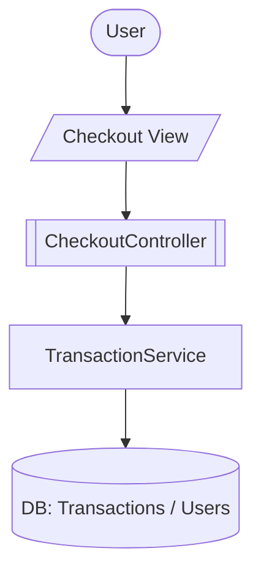

# Notation (Standard Symbols)

This project uses a small set of consistent symbols in Mermaid diagrams and documentation.

## Mermaid Flowcharts (`flowchart`)

### Symbol Table (Data Flow)

| Category | Mermaid Shape | Meaning | Example |
| --- | --- | --- | --- |
| Actor | `([Actor])` | Human actor (User/Admin) | `U([User])` |
| UI/View | `[/View/]` | UI screen/page | `CV[/Checkout View/]` |
| Controller | `[[Controller]]` | MVC controller endpoint/handler | `CC[[CheckoutController]]` |
| Service | `[Service]` | Business/service layer | `TS[TransactionService]` |
| Database | `[(DB: ...)]` | Persistence/storage (tables) | `DB[(DB: Transactions / Users)]` |
| External | `[(Email)]` | External system (SMTP/Email, etc.) | `SMTP[(Email)]` |

### Example

## Data Fields Naming

- **User profile fields**: stored on `Users.*` (example: `Users.NationalId`)
- **Per-transaction fields**: stored on `Transactions.*` (example: `Transactions.PostpaidNationalId`)
