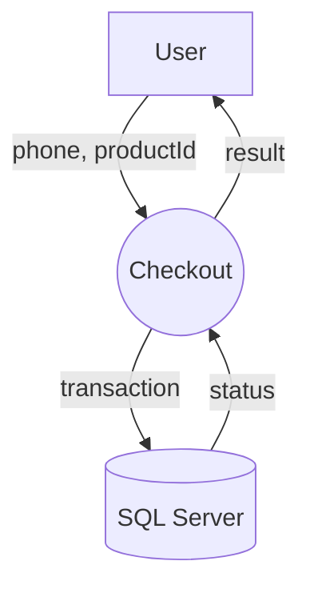

# Data Flow Diagram (DFD) Symbols

This page defines the only symbols used in `doc/data-flow/*.mmd`.

## Legend (English)

| Symbol | Meaning |
| --- | --- |
| Circle | **Process** (a transformation of data) |
| Rectangle | **External Entity** (source/sink outside the system) |
| Data store (open-ended rectangle) | **Data Store** (persistent data) |
| Arrow | **Data Flow** (data moving between elements) |

## Mermaid Syntax (Quick Reference)

Mermaid does not have the exact “open-ended rectangle” data store shape, so we use the closest readable equivalents:

| DFD Symbol | Mermaid suggestion |
| --- | --- |
| Process (circle) | `P((Process))` |
| External Entity (rectangle) | `E[External Entity]` |
| Data Store (open-ended rectangle) | `DS[(Data Store)]` |
| Data Flow (arrow) | `A --> B` (label with `A -->|payload| B`) |

## Connector Rules

- Use arrow `-->` for **data flow**.
- Label arrows when helpful: `A -->|token/session/transactionId| B`.

## Example

